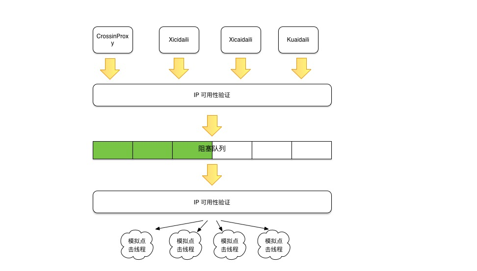

# click-traffic
###一 功能简介
1. 爬取线上主流网站的免费匿名ip，存放在队列中
2. 模拟Http请求点击某个页面，主要用来刷某个页面的点击量
###二 目录结构

├── main
│   ├── kotlin
│   │   └── com
│   │       └── lanxing
│   │           └── traffic
│   │               └── traffic
│   │                   ├── TrafficApplication.kt
│   │                   └── ippool
│   │                       ├── AbsProxyKt.kt
│   │                       ├── consumer
│   │                       │   └── HttpClientClickServiceKt.kt
│   │                       ├── model
│   │                       │   └── IpAddress.kt
│   │                       ├── observer
│   │                       │   ├── DelayThread.kt
│   │                       │   └── ThreadPoolListener.kt
│   │                       ├── proxy
│   │                       │   ├── CrossinProxyKt.kt
│   │                       │   ├── KuaidailiKt.kt
│   │                       │   ├── XicidailiKt.kt
│   │                       │   └── XiladailiKt.kt
│   │                       └── service
│   │                           └── ClickService.kt
│   └── resources
│       ├── WX20190517-152237@2x.png
│       └── application.properties
└── test
    └── kotlin
        └── com
            └── lanxing
                └── traffic
                    └── traffic
                        └── TrafficApplicationTests.kt

###三 项目架构
####1.整体构造

+ 使用生产者-消费者模式，多个代理爬取线上匿名网站的数据，获取IP地址和端口后进行IP可用性验证，验证可用的放入队列中
+ 消费者为模拟的点击程序，从队列里获取可用的IP，进行验证后进行模拟点击

####2.暂时使用的匿名IP地址：
+ crossion：http://lab.crossincode.com/proxy/get/?num=20
+ 快代理：https://www.kuaidaili.com/free/inha/
+ xici代理：https://www.xicidaili.com/nn/
+ xila代理：http://www.xiladaili.com/gaoni/

###四 使用
1. 将项目下载到本地
2. 修改application.properties中需要模拟点击的目标url
3. 执行 mvn clean package
4. 运行 java -jar ./target/traffic-0.0.1-SNAPSHOT
